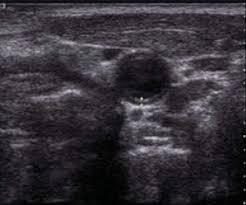
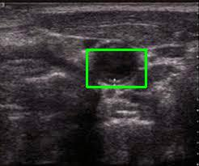
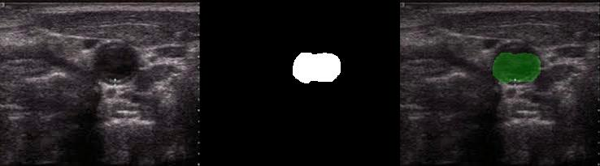

# carotid-seg

## 1. Task description
Localize a carotid on a ultrasound image.
A largest carotid should be detected after bifurcation.

An example of input image:

## 2. Data analysis
Based on a provided example I've found a public dataset with carotid scans: 
[link](https://data.mendeley.com/datasets/d4xt63mgjm/1)

This dataset contains 1100 images from 11 patients with segmented carotid mask.

Visual analysis of this dataset leads to a conclusion that we are looking for a 
round object in a grayscale image that takes no more than 10% of its size.

It also looks like that a simple preprocessing like image normalization + blur + binarization could give us a good basis for contours detection.

## 3. Baseline solutions

As was described above a solution based on classical computer vision algo should 
be a baseline. I've tried 3 different approaches:
- Hough Circles detection
- Contours detection
- Blobs detection

All of them based on binarization and produce pretty bad results so I decided 
to move forward to more advanced method.

## 4. Proposed method

Based on my experience the task should be pretty easy for a small NN model.
In view that I've found a good dataset for segmentation I decided to train a 
UNet model with a small EfficientNet B0 backbone.

I used the fact that the dataset contains 11 different patients and split it as 
follows: 1 patient for test, 2 for validation and 8 for training.

Based on dataset analysis some basic augmentations were added:
- Brighntess/Contrast manipulation
- Blur
- Flip
- CutOut (Coarse dropout)

The training took under 15 minutes on 3070 GPU.
The Dice Loss on validation is `0.04225`.

## 5. Evaluation results

An IoU score for the test set is 0.828.

## 6. Demonstration

A `demo.py` script was prepared for the demonstration purpose.
It was launched on provided examples and here are the results:

1. Bounding box visualization:

2. Segmentation mask visualization:

